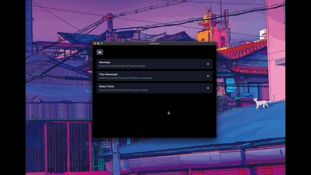

# Codeman
Project Manager for vscode

This app is just made to fit my personal needs. So I will only add more features as my needs grow, that is for now anyways. Right now it only supports Mac OS and Linux but I will add the support for windows once I need this app on windows.

To build the app you can simply run
```
$ yarn build
```
or you could use `npm` instead.

## Demo


Hold `shift` while clicking to close codeman after opening the project on vscode


